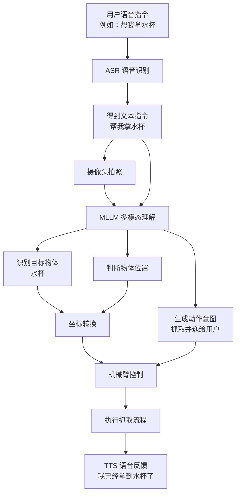
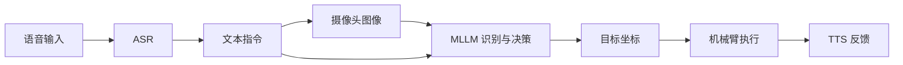

# 系统简化流程图

本项目当前目标是跑通一个简易闭环：
全语音控制 + 摄像头拍图 + MLLM 识别理解 + 机械臂执行动作

## 核心流程






## 文字说明

系统首先通过麦克风接收用户语音指令，并由 ASR 模块将语音转换为文本。随后摄像头采集当前环境图像，将文本指令和图像一起输入 MLLM。

MLLM 负责理解用户想要操作的目标物体，并结合图像判断物体位置，输出动作意图和目标位置信息。系统再将图像位置转换为机械臂可用坐标，驱动机械臂完成抓取、移动和递送动作。

动作完成后，系统通过 TTS 向用户播报执行结果。

```text
用户说话 -> 语音转文本 -> 摄像头拍图 -> MLLM 识别目标和位置 -> 转换机械臂坐标 -> 执行抓取 -> 语音播报结果
```

## 对应项目板块

当前简化流程只需要优先使用几个核心板块，其他模块可以暂时不展开。

| 简化流程步骤 | 使用的项目板块 | 对应功能 |
| --- | --- | --- |
| 用户语音输入 | `speech` | 接收麦克风输入 |
| ASR 语音识别 | `speech` | 把语音转成文本 |
| 摄像头拍照 | `vison` | 调用摄像头获取图像 |
| MLLM 识别与决策 | `mllm` | 理解用户指令和图像，判断要拿什么、怎么做 |
| 目标位置判断 | `vision` | 从图像结果中得到物体位置 |
| 坐标转换 | `vision` | 把图像坐标转换成机械臂坐标 |
| 机械臂执行 | `arm_control` | 控制 MyCobot 移动和夹爪抓取 |
| TTS 语音反馈 | `feedback` | 把执行结果播报给用户 |

## 模块职责

```text
speech
  负责输入：
  - 麦克风输入
  - 转换为文字
  
mllm
  负责理解：
  - 用户想干什么
  - 图像里有什么
  - 要执行什么动作

vision
  负责定位：
  - 目标物体在哪里
  - 图像位置如何变成机械臂坐标
  - 摄像头拍照

arm_control
  负责执行：
  - 移动机械臂
  - 打开/关闭夹爪
  - 抓取和递送

feedback
  负责输出：
  - TTS 语音播报执行结果
```

## 待定的模块

```text
cloud
  暂时不需要重点实现。
  只有当 MLLM 使用远程 API，并且需要单独管理云端请求时，再展开该模块。

safety
  可以保留最简单的急停和坐标范围检查。
  暂时不需要复杂安全状态机。

utils
  只作为辅助工具，例如读取配置文件。

scripts
  只用于后续编写简单演示启动脚本。
```

## 代码链路

```text
main.py
  -> speech 采集语音
  -> vision 采集图像
  -> mllm 调用 MLLM 识别图像并理解指令
  -> vision 转换目标坐标
  -> arm_control 控制机械臂抓取
  -> feedback 播报结果
```


